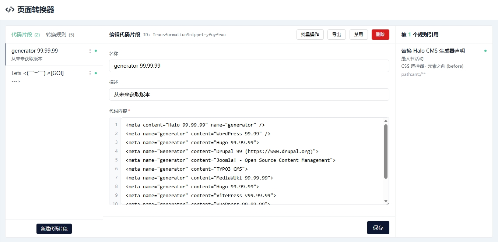
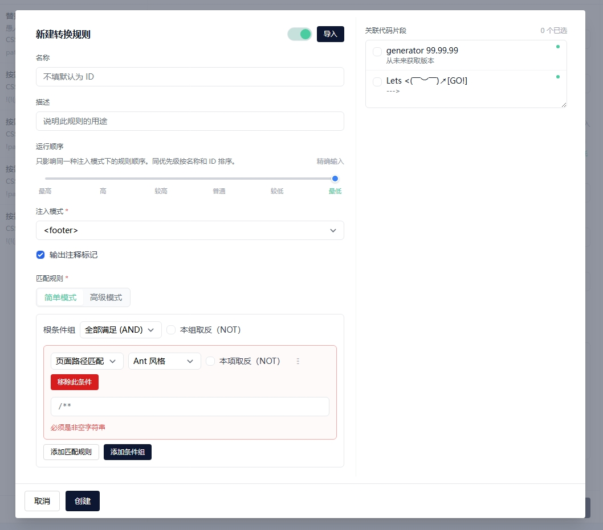
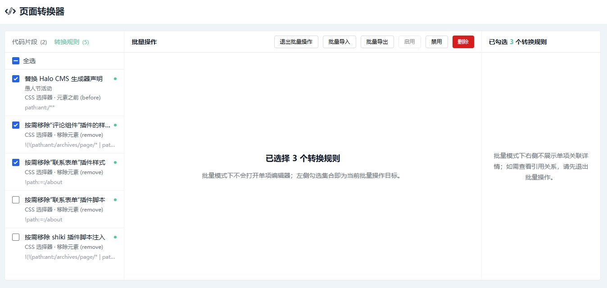
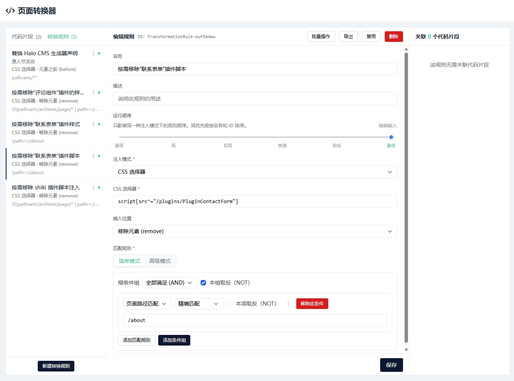

# Halo CMS 页面转换器


[](https://halo.run)

## 简介

这是一个用于**按规则改写指定页面内容**的 Halo CMS 插件。

Halo CMS 自带的全局页面注入，更适合“整站统一加一段内容”这类场景。  
如果你的需求更细一些，这个插件会更合适，比如：

- 仅在特定页面路径下转换
- 仅在特定模板 ID 下生效
- 仅对 CSS 选择器命中的元素做插入、替换、移除

这个插件不只追求“能改页面”，还想把下面这些事一起做好：

- 规则表达足够灵活，尽量覆盖常见场景
- 配置体验足够直接，尽量把问题拦在保存之前
- 运行时开销尽量收紧，别把成本花在无效判断上
- 控制台交互尽量顺手，少一点迷糊，少一点挫败感

特别感谢 [Erzbir](https://github.com/Erzbir) 开源这个插件的雏形，给了一个很好的起点。  
这个插件后续在规则能力、控制台体验和运行时处理上都继续推进到了新的高度，欢迎使用和反馈。

## 功能介绍

本插件目前提供这些能力：

- 三种转换模式：
    - `<head>`
    - `<footer>`
    - `CSS 选择器`
- 可组合的匹配规则：
    - 页面路径匹配（以 `/` 开头，例如 `/archives/page/2`）
    - 模板 ID 匹配（见下文[“模板 ID 匹配”](#模板-id-匹配)）
    - `AND` / `OR`
    - 本组 / 本项取反（`NOT`）
    - 条件组嵌套
- 两种规则编辑方式：
    - 简单模式
    - 高级模式（直接编辑规则树 JSON）
- 单项与批量导入导出：
    - 代码片段
    - 转换规则
- 规则级附加控制：
    - 是否输出 `PluginTransformer start/end` 注释标记
    - `runtimeOrder` 运行顺序
- 面向运行时的优化：
    - 高频正则复用编译结果
    - 实时规则 / 代码片段快照
    - 页面范围预判与规则匹配优化
    - 前后端双重校验，尽量避免坏规则落库

## 快速开始

如果你只是想先把插件跑起来，按下面三步做就够了：

1. 在 Halo CMS 管理后台进入：工具 -> `页面转换器`
2. 新建一个代码片段，再新建一条转换规则
3. 先用页面路径做条件，确认生效后再逐步补模板 ID、CSS 选择器等更细的限制

以下是页面预览：






## 转换模式

插件提供三种转换模式：

| 模式         | 实现方式                  | 说明                                            |
| ------------ | ------------------------- | ----------------------------------------------- |
| `<head>`     | `TemplateHeadProcessor`   | 注入到 `<head>` 中                              |
| `<footer>`   | `TemplateFooterProcessor` | 注入到 `<halo:footer />` 中，具体位置由主题控制 |
| `CSS 选择器` | `TransformerWebFilter`    | 通过 CSS 选择器匹配并处理所有命中的元素         |

> `CSS 选择器` 模式需要在服务端读取并处理完整 HTML，所以额外开销会更高。  
> 如果只是往 `<head>` 或页脚插内容，优先用 `head` / `footer` 会更省。

如果你在“全部满足（`AND`）”里加入“页面路径匹配”，插件就能先根据访问路径缩小范围，只处理少量需要改写 HTML 的页面。  
如果规则没法先按页面路径缩小范围，比如完全没有页面路径条件，或者写成“页面路径 OR 模板 ID”这种组合，插件当然也还能工作；只是 `CSS 选择器` 模式会先处理所有页面，再继续判断别的条件，开销会明显更高，配置页也会给出性能提示。

## 转换位置选项

在 `CSS 选择器` 模式下，可以选择以下位置策略：

- `append`：追加到目标元素内部末尾
- `prepend`：插入到目标元素内部开头
- `before`：插入到目标元素之前
- `after`：插入到目标元素之后
- `replace`：用代码片段替换目标元素
- `remove`：直接移除目标元素

> `remove` 的意思是“把整个元素节点删掉”，不是清空内容，也不是隐藏元素。  
> 所以 `remove` 模式下不需要关联代码片段；保存时会自动清空“关联代码片段”，后端也会拒绝这类错误数据。管理后台里选择 `remove` 后，也不会再显示“关联代码片段”选择区。

> 注入到 `<head>` 时仍需注意 HTML 合法性。  
> 例如 `<div>` 这类块级标签不会真正留在 `<head>` 中，而可能被浏览器或解析器移动到 `<body>`。

## 规则级附加选项

- 每条规则都可单独配置“注释标记”
    - 开启后会输出 `<!-- PluginTransformer start -->` 与 `<!-- PluginTransformer end -->`
    - 关闭后，注入内容原样输出，不额外添加注释
    - 默认开启，便于排查页面中的注入来源
- 每条规则也可单独配置 `runtimeOrder`：
    - 只影响**同一执行阶段**内的规则先后
    - 数值越小越先执行
    - 同值时先按规则名称字母序稳定执行；若名称相同或为空，再按规则 `id` 字母序兜底
    - 控制台提供六档快捷值：`0`、`429496729`、`858993458`、`1288490187`、`1717986916`、`2147483645`
    - 也可手动输入 `0 ~ 2147483647` 任意整数
    - 新建规则默认使用 `2147483645`

> `remove` 模式下不会显示“注释标记”选项，因为它会直接删除目标元素，不会留下适合输出注释标记的位置。

## 匹配规则

每条转换规则都会带一套“匹配规则”，用来描述“这条规则到底在什么情况下生效”。  
如果你在接口文档或报错信息里看到 `matchRule`，它说的就是这里这套东西。

### 简单模式

通过图形化界面编辑规则，支持：

- 页面路径规则
- 模板 ID 规则
- 全部满足（`AND`）
- 任一满足（`OR`）
- 本组 / 本项取反（`NOT`）
- 条件组嵌套

如果某个条件组暂时没有子条件，编辑器会直接提示错误；空组不能保存。

### 高级模式

如果你已经很熟悉这套规则，也可以直接编辑规则树 JSON。

- 根节点必须是 `GROUP`
- 叶子节点支持：
    - `PATH`
        - `ANT`
        - `REGEX`
        - `EXACT`
    - `TEMPLATE_ID`
        - `REGEX`
        - `EXACT`

示例：

```json
{
    "type": "GROUP",
    "operator": "AND",
    "negate": false,
    "children": [
        {
            "type": "PATH",
            "matcher": "ANT",
            "value": "/posts/**",
            "negate": false
        },
        {
            "type": "GROUP",
            "operator": "OR",
            "negate": false,
            "children": [
                {
                    "type": "TEMPLATE_ID",
                    "matcher": "EXACT",
                    "value": "post",
                    "negate": false
                },
                {
                    "type": "TEMPLATE_ID",
                    "matcher": "REGEX",
                    "value": "^(post|page)$",
                    "negate": false
                }
            ]
        }
    ]
}
```

## 导入与导出

插件支持单项导出 / 导入，也支持代码片段、转换规则各自独立的批量导出 / 导入。

导入导出遵循下面这些约束：

- 面向“可移植、可继续编辑的内容”
- 不携带 `id`、排序、系统元数据
- 规则导出 / 导入不携带关联关系
- 导出的 JSON 自动附带 `$schema`，方便在支持 JSON Schema 的编辑器里拿到提示和校验

批量模式支持：

- 批量导入
- 批量导出
- 批量启用
- 批量禁用
- 批量删除

如果你要接外部工具链，或者打算自己生成导入文件，完整的协议细节、字段约束和错误恢复语义见 [CONTRIBUTING.md](./CONTRIBUTING.md)。

## 编辑与校验

### 配置页体验

- 简单模式能即时定位多个错误；高级模式会尽量定位到具体 JSON 行
- 正则表达式会在前后端都做校验，不必等到运行时才发现“怎么没生效”
- 左侧“代码片段”和“转换规则”列表支持拖拽排序
- 支持单项导出，也支持进入批量操作模式
- 新建资源时可以先导入模板，也可以预先决定创建后默认启用还是禁用
- 编辑中切换标签、切换资源、直接新建或关闭弹窗时，如存在未保存修改会先确认
- 已修改但尚未保存的字段会显示“撤销修改”
- 高级模式下：
    - JSON 合法时可执行“格式化 JSON”
    - JSON 非法时可执行“重建 JSON”，按当前简单模式配置重新生成
- 代码片段内容与高级模式编辑器都带行号

### 写入期校验

为了减少“填了半天，结果一保存才发现不合法”的情况，这套校验分两层：

- 编辑时：前端尽量即时提示错误，方便边改边修
- 保存时：后端再次兜底校验，避免坏数据落库

导入代码片段 / 转换规则 JSON 时，也会先做一轮前端校验。  
如果只是少了几个可以自动补默认值的字段，会直接补上；如果问题还属于“能导进来、再慢慢改”的类型，就允许先导入、再修改。

完整的控制台状态模型、排序语义、批量导入流程和未保存草稿处理约定见 [CONTRIBUTING.md](./CONTRIBUTING.md)。

## 运行时与性能

### 运行时表现

能在请求外提前做掉的事，就尽量不要留到真正处理页面时再做。

- 高频正则会复用编译结果，避免重复 `Pattern.compile`
- `ANT` 风格的页面路径匹配会复用统一匹配器，减少重复判断
- 规则会先做优化和页面范围预判，减少不必要的 HTML 改写
- 规则变更会自动同步到实时规则快照，连接抖动后也会自动恢复
- 删除代码片段时会先进入后台清理流程；控制台列表会立即隐藏这类“删除中”的资源，它们也不会再出现在可编辑 / 可关联集合里，避免出现“明明已经删了，怎么列表里还在”的滞后感
- 若 `CSS 选择器` 规则还不能先按页面路径缩小范围，插件仍会工作，但开销会明显更高

更完整的校验清单、规则优化细节、运行时处理链路和并发写入约束见 [CONTRIBUTING.md](./CONTRIBUTING.md)。

## 模板 ID 匹配

### 已知限制

- 模板 ID 匹配依赖页面正确暴露 `_templateId`
- 对 Halo 自带页面，或者正确接入模板 ID 的插件页面，这条链路通常都能稳定工作
- 如果第三方页面没有暴露模板 ID，插件就拿不到可靠的模板身份
- 遇到这种情况时，建议优先改用路径这类更稳定的条件

### 常见模板 ID

### Halo 内置页面

| 模板 ID      | 说明         |
| ------------ | ------------ |
| `index`      | 首页         |
| `categories` | 分类列表页   |
| `category`   | 单个分类页   |
| `archives`   | 归档页       |
| `post`       | 文章详情页   |
| `tag`        | 单个标签页   |
| `tags`       | 标签列表页   |
| `page`       | 单个独立页面 |
| `author`     | 作者页       |

### 常见插件页面

| 模板 ID   | 来源                                                                      | 说明                                     |
| --------- | ------------------------------------------------------------------------- | ---------------------------------------- |
| `moments` | [瞬间插件](https://github.com/halo-sigs/plugin-moments)                   | 瞬间列表页，常见路径为 `/moments`        |
| `moment`  | [瞬间插件](https://github.com/halo-sigs/plugin-moments)                   | 瞬间详情页，常见路径为 `/moments/{slug}` |
| `photos`  | [图库管理插件](https://github.com/halo-sigs/plugin-photos)                | 图库页，常见路径为 `/photos`             |
| `friends` | [朋友圈插件](https://github.com/chengzhongxue/plugin-friends-new)         | 朋友圈页，常见路径为 `/friends`          |
| `douban`  | [豆瓣插件](https://github.com/chengzhongxue/plugin-douban)                | 豆瓣页，常见路径为 `/douban`             |
| `bangumi` | [BangumiData 插件](https://github.com/ShiinaKin/halo-plugin-bangumi-data) | 番剧页，常见路径为 `/bangumi`            |

> 上面这些字符串本身就是要填写的模板 ID。  
> 第三方插件是否能用于“模板 ID 匹配”，取决于它有没有正确提供 `_templateId`。

## 开发与贡献

如果你准备改代码、提 PR、看实现细节，参见 [CONTRIBUTING.md](./CONTRIBUTING.md)。

## 许可证

[GPL-3.0](./LICENSE) © HowieHz